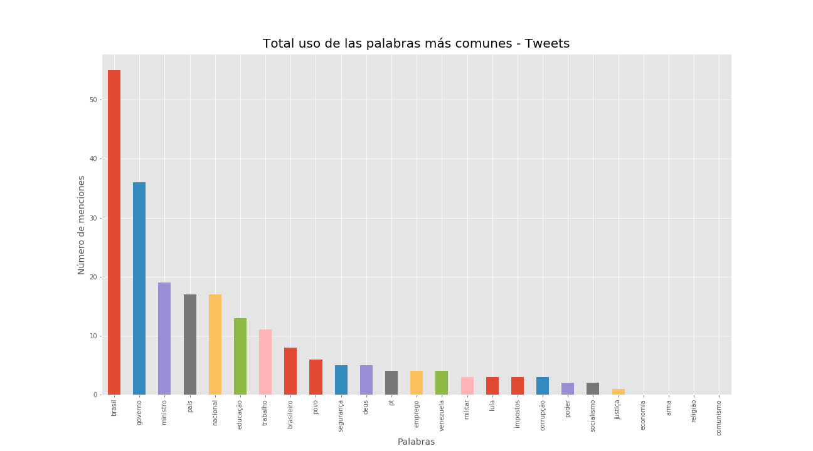
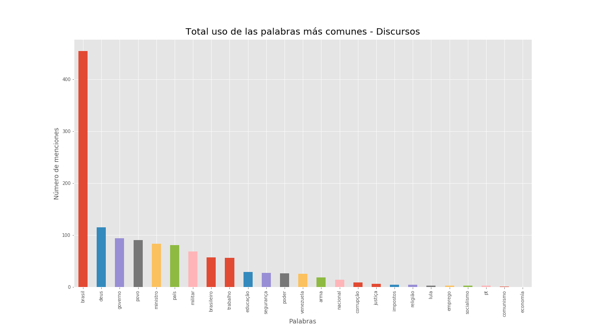
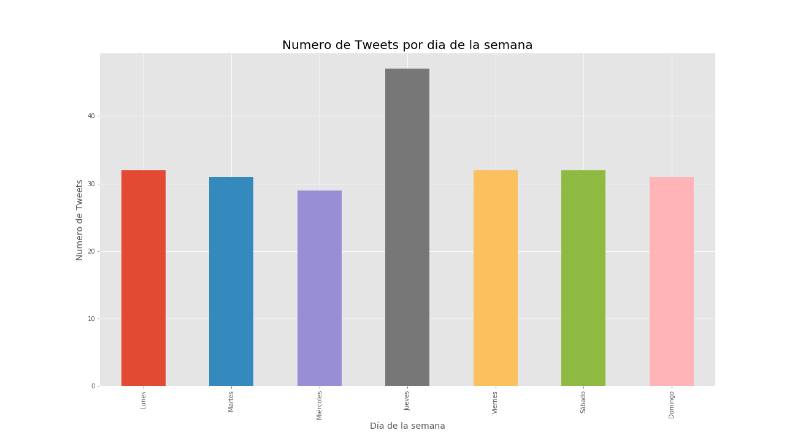
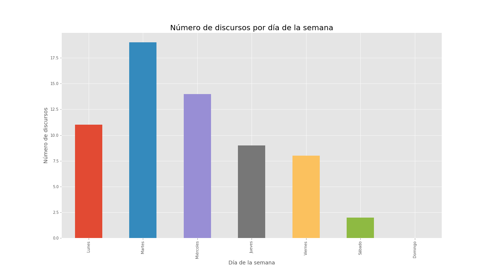

# PROYECTO-FINAL
Proyecto final de la clase de Métodos Computacionales para Políticas Públicas

## Samara Lino Salamanca

# Análisis de tweets y discursos de Jair Bolsonaro

## Descripción y Motivacíon

El presidente recién electo de la República Federativa de Brasil a lo largo de su campaña (y ahora electo) ha sido bastante criticado por su manera de expresarse,  ya sea por el uso de discursos extremistas o la difusión de fake news principalmente por redes sociales, que dado la coyuntura política brasileña permitió atraer a las clases populares facilitando su llegada a la presidencia en el 2019. 

Para este proyecto empleare la técnica de scraping para extraer los 47 discursos disponibles en la pagina oficial de presidencia (www2.planalto.gov.br), me apoyaré con la API Twitter Archiver para descargar los tweets del presidente (desde 06/04) y los analizaré por medio de las herramientas de análisis de textos de Python. 

Algunas preguntas/ problemas que motivaron el proyecto:

- Jair Bolsonaro fue electo con un discurso de ideología conservadora, sus principales promesas de campaña fueron  privatización de empresas oficiales, apoyo al gremio ganadero, seguridad publica con base a policías armados, política de posición de armas por medio de civiles, el “fin” de la izquierda y de la corrupción, ¿Siguen estando presentes en sus discursos estas posturas políticas después de su elección? 
- El uso de las redes sociales en su campaña fue de suma importancia y sigue siendo el principal medio de comunicación de la presidencia con los ciudadanos. En este gobierno el uso de medios oficiales no es primordial, ya que muchas veces los informes, noticias o comunicados oficiales son anunciados en primera instancia por las redes sociales. En relación a estas características, quisiera entender la semántica usada en esos diferentes medios de comunicación y la variabilidad de su vocabulario en cada situación. 
- Cómo los eventos específicos como reformas políticas, nombramiento de ministros, sesiones en la cámara, eventos sociales, etc., se ven reflejados en los datos.
- El uso de fake news en la política en los últimos años ha crecido de manera sustancial, Jair Bolsonaro se aprovecha de ellas tanta para ser victimario como para hacerse victima en un contexto de persecución política en contra de el, ¿Sigue siendo constante el uso de esa “herramienta” en su trayectoria política? 
- ¿ Que información adicional acerca de las intervenciones presidenciales puede ser analizada a partir de la estadística descriptiva de los datos obtenidos ?

 

  
  

## Métodos usados
- API Twitter Archiver
Use esta API para bajar los tweets del presidente Jair Bolsonaro (@jairbolsonaro), utilice el método de PANDAS para guardar la infomración y poder realizar análisis de datos.

- Gestión y almacenamiento de datos
Tanto para los tweets como para la base de datos de los discursos, utilicé PANDAS, para lograr almacenar los datos, tanto de twwets como de discursos, luego se almaceno en un archivo 'Pickle'
- Limpeza de datos
Se realizo la limpieza de datos con base a metedologías aprendidas en clase y códigos creados por el profesor Santiago Matallana

- Análisis de texto y gráficos
Se utlizaron códigos para analizar collocations, Lexical dispersión y palabras en contextos. Además de toda la librería de matplotlib para análisis gráficos.

- Tableau
La herramienta fue utlizada para gráficos en mapas.

## Hallazgos encontrados

- Tweets: 234 | Días analizados: 47
- Discursos: 63 | Días analizados: 135

- Se encuntra un léxico y semántica diferenciadas en los dos medios de comunicaión utilizados por el presidente.

  

- Días diferentes de itervención   

  
  
  
 
